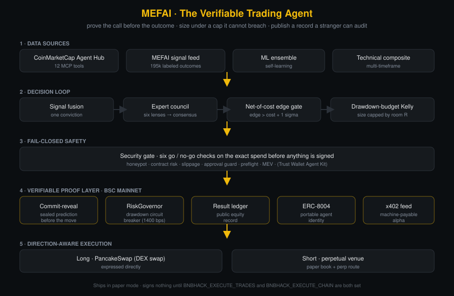

# MEFAI · The Verifiable Trading Agent


> An autonomous trading agent that proves every call **before** the
> outcome is known, sizes each position against a drawdown budget it cannot
> breach, and writes its entire record to a public ledger. Built for the
> **BNB HACK · AI Trading Agent Edition**.

A trading track record is normally something you have to *believe*. A screenshot,
a Telegram message, a curve that could have been drawn after the fact. MEFAI
takes the opposite stance: the agent **commits to a sealed prediction in a BSC
mainnet contract before the move happens**, reveals it after, and anchors its
equity to a contract that halts trading the moment a drawdown limit is crossed.
The result is a record a stranger can audit instead of one they must trust.

---

## What it does

MEFAI fuses many independent market signals into a single conviction score,
sizes a position with a drawdown-budgeted fractional-Kelly engine, clears every
spend through a security gate, and publishes a verifiable proof for each
decision. It runs three things at once:

| Pillar | What it is |
| --- | --- |
| **Autonomous Trading Agent** | A self-driving decision loop that turns market data into one conviction, sizes it under a hard drawdown cap, and seals each trade as a commit-reveal proof. |
| **CMC Strategy Skills** | Five backtested strategy skills (allocation, TP/SL optimization, narrative rotation, regime governing, meta-composition) powered by 181k labeled outcomes and the CoinMarketCap Agent Hub. |
| **Verifiable Protocol** | A commit-reveal prediction registry, a chain-anchored drawdown circuit breaker, a unified intelligence index, and an x402 machine-payable signal feed. |

### Ships in paper mode by default

The agent decides, gates, sizes, plans and publishes its live state but
**signs nothing** until you explicitly opt in. Going live is gated behind two
separate environment flags (`BNBHACK_EXECUTE_TRADES` for spot,
`BNBHACK_EXECUTE_CHAIN` for verifiable writes), and each still requires its own
key to be present. You can run the full pipeline end to end without ever
touching a private key.

---

## How a decision is made

```
market data ─▶ ten-source signal fusion ─▶ net-of-cost edge gate
                                                       │
                    drawdown-budgeted Kelly sizing ◀───┘
                                  │
           security gate (6 core checks + advisory reads) ─▶ commit-reveal proof ─▶ trade
```

1. **Signal fusion** blends ten weighted sources · the MEFAI signal score, a
   deep composite, the Brain ML ensemble, Kronos forecasts, cross-venue order
   flow, the CoinMarketCap regime / technicals / derivatives gates and a
   per-asset funding contrarian · into one direction and conviction.
2. **The net-of-cost edge gate** only sizes a trade when the cell's *measured*
   expectancy clears the full round-trip cost beyond its own error bar. It would
   rather skip a marginal trade than bleed fees on a coin flip.
3. **Drawdown-budgeted sizing** fits real win rates and payoffs from labeled
   history and never lets exposure breach the equity floor.
4. **The security gate** runs six core go / no-go checks on the exact spend
   (honeypot, contract, slippage, approval, preflight, MEV) plus advisory reads
   such as gas sanity, the standing allowance and the risk governor, before
   anything is signed. Only a core check can block; the advisory reads warn.
5. **The commit-reveal proof** seals the prediction on BSC mainnet before the
   move, so the record cannot be backfilled.

Riding alongside the order flow, a **six-expert council** narrates and
stress-tests the same data live on the site: six specialist agents debate every
asset from different lenses in the open, so anyone can watch the reasoning
behind a call, not just its result.

The engine is **direction-aware**: a long is expressed directly on a DEX; a short
is simulated honestly in the paper book and routes through a perpetual venue
behind the execute flag when live, so the book earns in falling weeks as well as
rising ones.

---

## Architecture



Five layers, top to bottom: data sources fuse into one conviction, the decision
loop sizes it under a drawdown cap, a fail-closed security gate clears the exact
spend, the verifiable proof layer seals it on BSC mainnet, and execution is
direction-aware. Nothing is signed until both execute flags are set.

---

## What makes it trustworthy

A trading agent is easy to claim and hard to trust. MEFAI closes that gap on
three fronts at once. Its edge is **measured, not asserted**: every signal is
fitted against a base of 181k labeled outcomes, so the sizing engine works from
real win rates and payoffs and the leaderboard ranks each source by realized
expectancy. Its calls are **provable, not backfillable**: each decision is sealed
as a commit-reveal proof on BSC mainnet *before* the move, so the record cannot
be drawn after the fact. And its risk is **bounded, not promised**: equity is
anchored to a RiskGovernor contract that halts trading the moment a drawdown
budget is crossed, with the agent's internal stop sized below the RiskGovernor contract cap so
it brakes before the limit. Measured edge, sealed before the outcome, capped by a
contract it cannot breach · a record a stranger can audit instead of one they
must trust.

---

## Repository layout

```
bnbhack/
  agent/          The autonomous loop and its engine
    loop.py             decision + commit-reveal + lifecycle driver
    fusion_core.py      signal fusion into one conviction
    fusion_providers.py per-source readers (signals, ML, technical, CMC)
    sizing.py           drawdown-budgeted fractional-Kelly + edge gate
    position_manager.py direction-aware position lifecycle (entries, TP/SL, trail)
    tp_sl_optimizer.py  empirical TP/SL brackets from labeled outcomes
    leaderboard.py      per-source realized-expectancy ranking
    chain_writer.py     commit-reveal + equity anchoring with RPC failover
    bsc_exec.py         DEX execution adapter and spend caps
    tx_security_solver.py the pre-spend security gate
    agent_card.py       ERC-8004 agent identity document
    erc8004_identity.py identity registration helpers
    cmc_mcp.py          CoinMarketCap Agent Hub client
    x402_feed.py        HTTP 402 machine-payable signal feed
  api/
    backend.py          FastAPI service exposing the live cockpit + skills
  skills/           Five CMC strategy skills, each with its own backtest
    risk-budgeted-allocator/
    empirical-tp-sl-optimizer/
    narrative-rotation/
    regime-risk-governor/
    meta-strategy-composer/
  contracts/        Solidity for the verifiable layer
    src/CommitRevealPredictionRegistry.sol
    src/RiskGovernor.sol
frontend/
  compete/          The jury-facing presentation sub-site (React + TypeScript)
```

---

## Quickstart

```bash
# 1. Install dependencies and configure
pip install -r requirements.txt
cp .env.example .env      # fill in your own values; defaults run in paper mode

# 2. Generate a synthetic sample book so the engine has data to fit
#    (the production book of labeled outcomes is private and gitignored).
#    Point every component at it with one env var (default is data/signal.db).
python3 bnbhack/data/make_sample_db.py
export MEFAI_SIGNAL_DB="$PWD/bnbhack/data/signal.db"

# 3. Verify the engine: drawdown-budget guarantee + direction-aware PnL
python3 -m unittest discover -s bnbhack/tests

# 4. Run one cycle of the autonomous loop (paper mode, signs nothing)
python3 bnbhack/agent/loop.py --once

# 5. Serve the live cockpit API
python3 -m uvicorn backend:app --app-dir bnbhack/api --host 127.0.0.1 --port 8401

# 6. Run a strategy-skill walk-forward backtest
python3 bnbhack/skills/risk-budgeted-allocator/backtest/walk_forward.py

# 7. Build and test the verifiable layer (needs no key, no RPC, no funds)
cd bnbhack/contracts && npm install && npm test   # 15 tests, all green
```

The backtests are out-of-sample walk-forward simulations: each cell learns its
edge from a training window and is tested on a later window it never saw, with
equity compounded net of cost under the same drawdown budget the live engine
uses.

### One-click live verification

You should not have to trust this README. One script reads the running agent and
the public BNB Chain and confirms the whole verifiable chain end to end, with no
key, no wallet and no funds:

```bash
bash scripts/verify_live.sh
```

It checks, in order: the autonomous loop is live (`/loop/state`), signal fusion
resolves to one conviction (`/fusion`), drawdown-budgeted sizing returns a real
decision (`/sizing`), TP/SL brackets come from labeled history (`/tp-sl`), the
security gate runs its go / no-go checks (`/security/evaluate`), the x402 feed is
served (`/x402/products`), sources are ranked by realized expectancy
(`/leaderboard`), the UVII is computed over the resolved record (`/uvii`), and
finally that the result ledger, the ERC-8004 identity, the commit-reveal registry
and the RiskGovernor each carry deployed bytecode (a key-free `eth_getCode` read
against the public RPCs). Every line prints the live value it read and a BscScan
link you can open by hand. It exits `0` only when all checks pass.

Point it at a local cockpit instead of the public edge with one env var:

```bash
MEFAI_API_BASE=http://127.0.0.1:8401 bash scripts/verify_live.sh
```

### A note on the data and the frontend

- **The labeled-outcome book is private.** The 181k resolved outcomes are real
  account data, excluded by `.gitignore`. `bnbhack/data/` ships the exact table
  schema and a seeded, clearly-synthetic sample generator so anyone can run the
  full pipeline locally without it. See `bnbhack/data/README.md`.
- **`frontend/compete/` is an excerpt, not a standalone app.** It is the
  jury-facing presentation that lives inside the larger MEFAI terminal, included
  here as source for review. It reads from the cockpit API in step 5 and is not
  meant to be built in isolation.

---

## The edge

The strategy is grounded on a base of **181k labeled outcomes across forty
assets**. Every signal the agent reads has been resolved against what the market
actually did, which is what lets the sizing engine fit real win rates and payoffs
rather than guesses, and what lets the leaderboard rank each source by realized
expectancy. A win rate near fifty percent is not weak when the reward-to-risk
ratio carries positive expectancy. The private book covers all forty assets; the
public sample DB shipped for reproducible backtests ships twenty illustrative
symbols of the same shape, so every figure in this repo regenerates without the
private data.

---

## The sponsor stack

- **BNB Chain** · the settlement and proof layer. PancakeSwap and a perpetual
  venue for execution; the registry, governor, ledger and identity for verification.
- **CoinMarketCap Agent Hub** · twelve MCP tools that gate global metrics,
  derivatives, narratives, market cap, technicals and macro events into the
  regime read.
- **Trust Wallet Agent Kit** · execution and self-custody safety. The approval
  guard and the security solver run from this kit.
- **ERC-8004** · the agent's portable cross-protocol identity contract.
- **x402** · the machine-payable feed standard that lets agents pay agents for
  proven alpha with no human in the loop.

---

## Security

MEFAI can move money, so it is built to fail safe. It signs nothing until two
separate flags are set, clears every spend through a fail-closed security gate,
talks only to a loopback proxy and an allowlisted set of RPC hosts, and anchors
its equity to a contract that halts trading when a drawdown budget is breached.
For transparency during the judged window, you can subscribe to the agent's
trade feed via `@mefainews_bot` (start `?start=agentfeed`). Each leg is then
delivered to your own Telegram chat with a BscScan link and nothing else · the
feed is read-only, carries no keys or commands, and is fanned out per subscriber
by `bnbhack/agent/notify.py`.
The full posture, threat model and disclosure process are in
[`SECURITY.md`](SECURITY.md). Verified contract addresses are in
[`bnbhack/contracts/DEPLOYMENTS.md`](bnbhack/contracts/DEPLOYMENTS.md).

---

## Acknowledgements · the MEFAI open stack

This agent does not stand alone. It draws on the broader MEFAI stack, published
as open source in sibling repositories. The signal feed it fuses as its primary
source, the indicator and risk research behind the composite read and the sizing
engine, the walk-forward backtest tooling and the market-intelligence MCP servers
all live in their own repos:

- [`mefai-signal-engine`](https://github.com/mefai-dev/mefai-signal-engine) · the MEFAI signal feed
- [`mefai-engine`](https://github.com/mefai-dev/mefai-engine) · the core inference engine
- [`mefai-risk-ai`](https://github.com/mefai-dev/mefai-risk-ai) · risk and drawdown research
- [`mefai-indicators`](https://github.com/mefai-dev/mefai-indicators) · the technical indicator library
- [`mefai-backtest`](https://github.com/mefai-dev/mefai-backtest) · walk-forward backtest tooling
- [`binance-intelligence-mcp`](https://github.com/mefai-dev/binance-intelligence-mcp) · market-intelligence MCP server
- [`bnbchain-mcp`](https://github.com/mefai-dev/bnbchain-mcp) · BNB Chain MCP tooling
- [`mefai-python-sdk`](https://github.com/mefai-dev/mefai-python-sdk) · [`mefai-cli`](https://github.com/mefai-dev/mefai-cli) · client SDK and CLI

The full set is published under [github.com/mefai-dev](https://github.com/mefai-dev).

---

## License

Released under the MIT License. See `LICENSE`.
