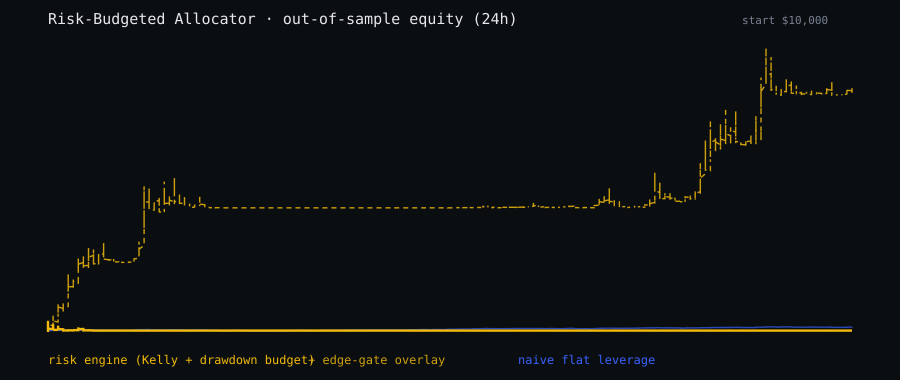

# MEFAI Strategy Skills · CMC Agent Hub

Five composable trading-strategy skills, each conforming to the CMC Agent Skill
schema (`skill.json` · `cmc-agent-skill/1.0`). Every skill is **read-only,
network-free in CI, and deterministic**: it reads a pinned labeled-outcome store
and never trades, signs, or writes. The production edge comes from the private
base of resolved MEFAI signal outcomes; that edge is expectancy / risk-adjusted
and drawdown-bounded, not a directional hit-rate (the live 24h win rate sits near
50%, about 49.9%). That book is private · its Merkle root is sealed on BSC
mainnet and the algorithm is open in `scripts/seal_dataset.py` (see the
*Verifiable dataset commitment* section of the root README). A deterministic
sample-DB generator ships; one command regenerates the pinned DB byte-for-byte
(`sha256 f7202dd2…2bb0282d`). The sample covers **20 illustrative symbols (40000
labeled outcomes)** of the same shape as the private base. Running the skills on
that sample proves the **engine and the method** · that the backtests, hashes and
invariants behave as claimed · it does **not** prove a real trading edge; the
sealed root plus the private DB do that.

> Verify it yourself · no displayed number is one you cannot reproduce.

```bash
python3 bnbhack/data/make_sample_db.py        # writes the pinned sample DB
python3 bnbhack/skills/run_backtests.py        # runs + fingerprints every skill
```

The orchestrator writes [`BACKTEST_REPORTS.json`](BACKTEST_REPORTS.json) with a
repository-stable `repro_digest`. On the shipped sample DB
(`sha256 f7202dd2…2bb0282d`, 40000 labeled outcomes) the current digest is:

```
repro_digest  8800033e6f55d918369cf5da839430cebbd81ad947823d144f1760327e74e5c8
overall       PASS  (5/5 skills)
```

A judge re-runs the same two commands and compares the digest. Same dataset plus
same code yields an identical digest.

---

## The five skills

| Skill | What it decides | Engine module | Backtest kind |
| --- | --- | --- | --- |
| [empirical-tp-sl-optimizer](empirical-tp-sl-optimizer/) | Best risk-honest TP/SL bracket for a slice, replayed from recorded barrier-touch times with no look-ahead | `tp_sl_optimizer.py` | invariant-check |
| [narrative-rotation](narrative-rotation/) | Which symbols to hold · ranks by realized expectancy and skill, optionally tilted by live CMC narrative | `leaderboard.py` | invariant-check |
| [regime-risk-governor](regime-risk-governor/) | Whether to deploy now and at what size · gates a bracket against live regime and remaining drawdown room | `tp_sl_optimizer.py` | invariant-check |
| [risk-budgeted-allocator](risk-budgeted-allocator/) | How large · position notional, leverage, margin sized so a trade cannot breach the max-drawdown cap | `sizing.py` | **walk-forward** |
| [meta-strategy-composer](meta-strategy-composer/) | All four at once · one end-to-end trade plan inside a single drawdown budget | `fusion_core.py` | invariant-check |

`invariant-check` proves a structural property (size collapses to zero at the
drawdown cap, recommend implies positive expectancy above one standard error,
top basket beats bottom basket, etc.) · a PASS is **not** a profit claim. Only
the allocator ships a true out-of-sample equity engine (`walk-forward`).

---

## Composition

The composer is a meta-skill: it chains the other four into one decision and
keeps the summed worst-case loss inside the drawdown budget.

```
                       meta-strategy-composer
                                 |
        +------------------+-----+------------+------------------+
        |                  |                  |                  |
  narrative-rotation   empirical-tp-sl   regime-risk-governor  risk-budgeted
   (what to trade)      (where TP/SL)     (deploy? scale?)      -allocator
        |                  |                  |                (how large)
        +------------------+--------+---------+------------------+
                                    |
                       195k labeled signal outcomes
                       (pinned synthetic sample in CI)
```

`narrative-rotation` selects the leaders, `empirical-tp-sl-optimizer` sets the
bracket, `regime-risk-governor` returns a `risk_scale` that feeds in as the
allocator's `regime_gate`, and `risk-budgeted-allocator` converts the decision
into a notional that physically cannot push drawdown past the cap.

---

## CMC Agent Hub tool matrix

`bnbhack/agent/cmc_mcp.py` wires the canonical 12-tool CMC surface (TTL cache +
single-flight + multi-key rotation). The matrix below shows which tools each
skill declares. **In CI these are not called** · every backtest runs from the
labeled-outcome store only, so a no-network judge still gets identical hashes.
Tool calls activate in **live** mode (no CMC key is committed); each skill's
`skill.json` is the source of truth for its declarations.

| CMC tool | tp-sl | narrative | regime | allocator | composer |
| --- | :-: | :-: | :-: | :-: | :-: |
| trending_crypto_narratives | | x | | | x |
| get_crypto_quotes_latest | | x | | | x |
| get_global_metrics_latest | | x | x | x | x |
| get_global_crypto_derivatives_metrics | | | x | x | x |
| get_upcoming_macro_events | | | x | | x |

The remaining tools on the 12-surface (`get_crypto_technical_analysis`,
`get_crypto_marketcap_technical_analysis`, `get_crypto_metrics`,
`get_crypto_latest_news`, `search_cryptos`, `search_crypto_info`,
`get_crypto_info`) drive the live cockpit and CMC pages rather than these CI
backtests.

---

## Hero · the allocator's out-of-sample equity curve

The risk-budgeted-allocator is the only skill with a real walk-forward equity
engine. It splits the labeled outcomes by time, estimates each bucket's edge on
the **train window only**, then walks the held-out test window forward sizing
with the same drawdown-budget fractional-Kelly model (train-window edge
estimates, no shrinkage applied in the backtest). The artifact is pinned under
the same hash-guard as the invariant backtests.



From the shipped
[`equity_report.json`](risk-budgeted-allocator/output/equity_report.json)
(public synthetic sample · 16000 out-of-sample candidate signals · net of a 0.2% V3
round-trip · sub-year window so metrics are reported on a window basis, not
annualised CAGR):

| Leg | Max drawdown | Total return | Calmar (window) |
| --- | --: | --: | --: |
| Risk engine (drawdown-budget Kelly) | 14.0% | -0.19% | -0.013 |
| Risk engine + net-of-cost edge gate | 14.0% | +402.56% | 28.754 |
| Naive flat leverage (no drawdown stop) | 2.53% | +5.63% | 2.222 |

Read these honestly. On this synthetic sample the **naive flat-leverage leg runs
the same edge-positive signals at the engine's own average leverage but with no
drawdown stop**, and over this short window it still posts a positive return ·
the engine's value is the *bounded* drawdown, not a bigger number. The edge-gate
overlay (enabled live at the 24h / 0.2% production basis) is what lifts net
return while holding the same 14% drawdown cap. The eye-catching +402.56% is a SYNTHETIC artifact: the sample generator embeds a
fixed per-symbol edge that a leverage-scaled Kelly leg compounds over the window,
so the headline number reflects average leverage (the engine runs far higher
notional than the naive leg) far more than signal selection, and would be
impossible on a live market. The honest takeaways are the **bounded 14% drawdown**
and the **net-of-cost edge gate**, not the percentage. These figures demonstrate the
engine's mechanics and ablation; they are **not** a live track record, and the
real per-signal edge is thin and at or below zero net of cost at a roughly 50% hit rate
shown by the sealed production dataset.

---

## Reproducibility contract

- Each skill writes `output/report.manifest.json` carrying the dataset sha256,
  the code sha256 (backtest + engine modules), the result PASS/FAIL, and a
  `content_hash` over the canonical report.
- The allocator additionally pins a `walk_forward` block (the equity report's
  own content hash) inside the same manifest.
- [`BACKTEST_REPORTS.json`](BACKTEST_REPORTS.json) indexes all five plus the
  repository-stable `repro_digest`.
- The harness records `MEFAI_SIGNAL_DB` resolution, Python version, and platform
  so a mismatch is visible.
- The `repro_digest` is computed only over dataset and per-skill provenance, so
  it is stable across machines. On a re-run only `generated_at` (a wall-clock
  field, excluded from the digest) changes; the digest itself does not.

The figures above are reproduced on the public sample and prove the method, not
a live track record. Proof of the real outcomes lives on chain: the production
dataset's Merkle root is sealed on BSC mainnet (see *Verifiable dataset
commitment* in the root README) and live forward calls land on the result ledger
`0x77511fEFF4c0CA8bD5aeA8d64dC6a8dAe88C0744`.
